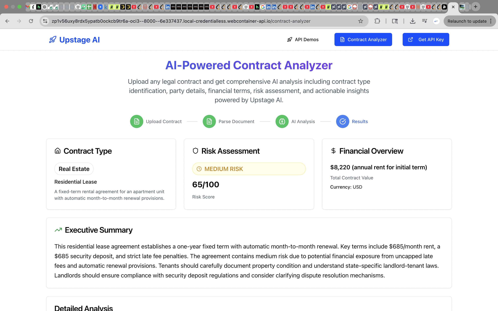
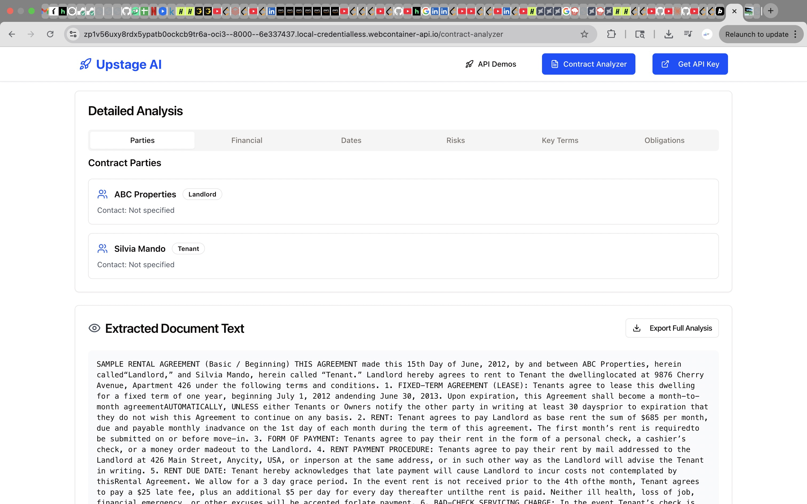
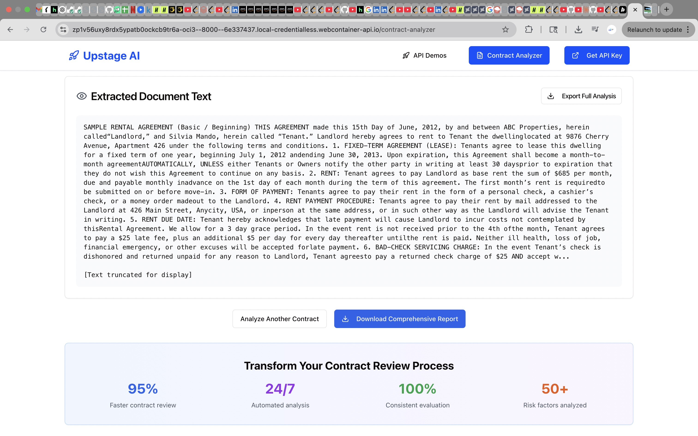
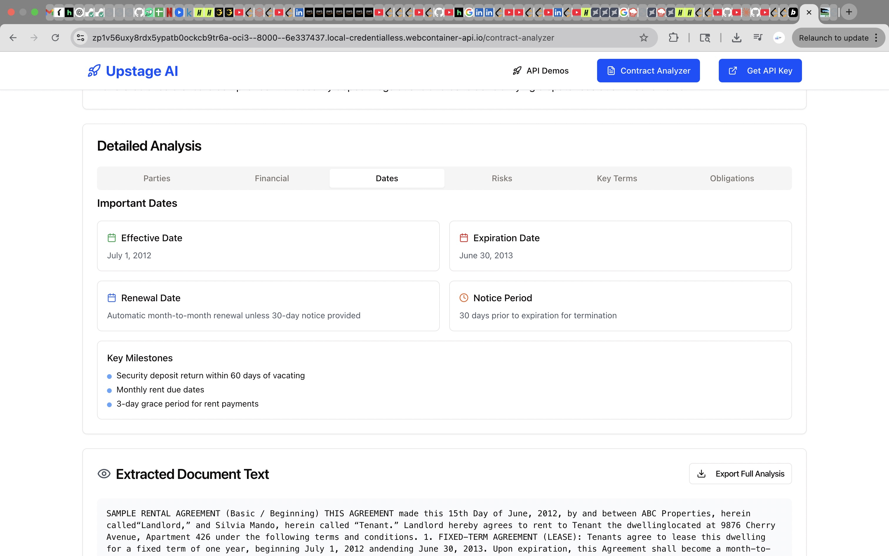
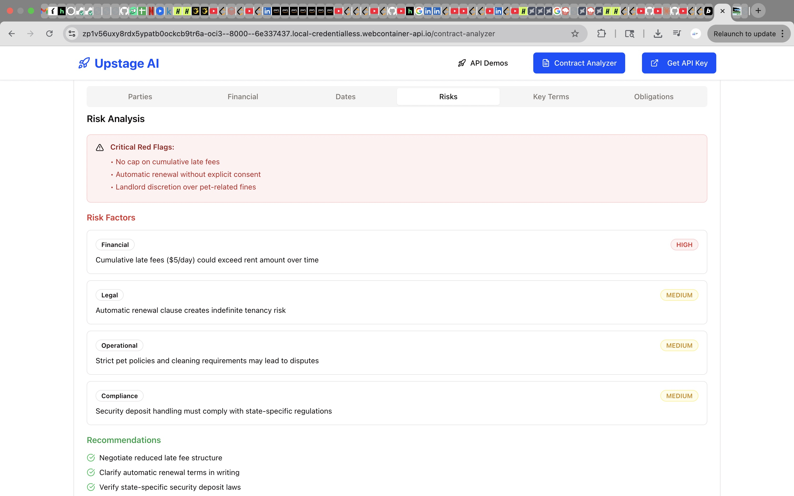
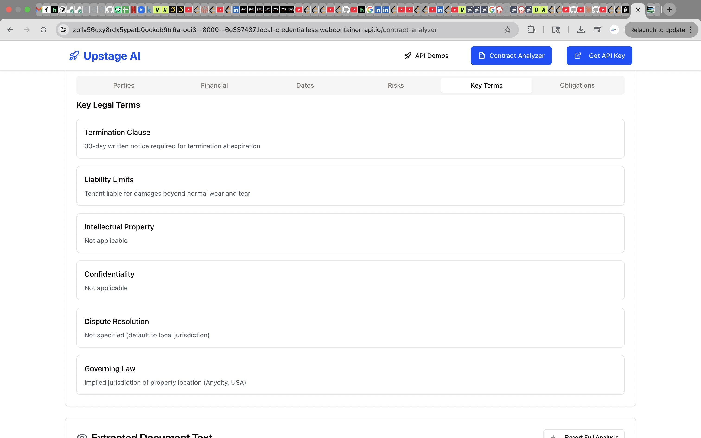
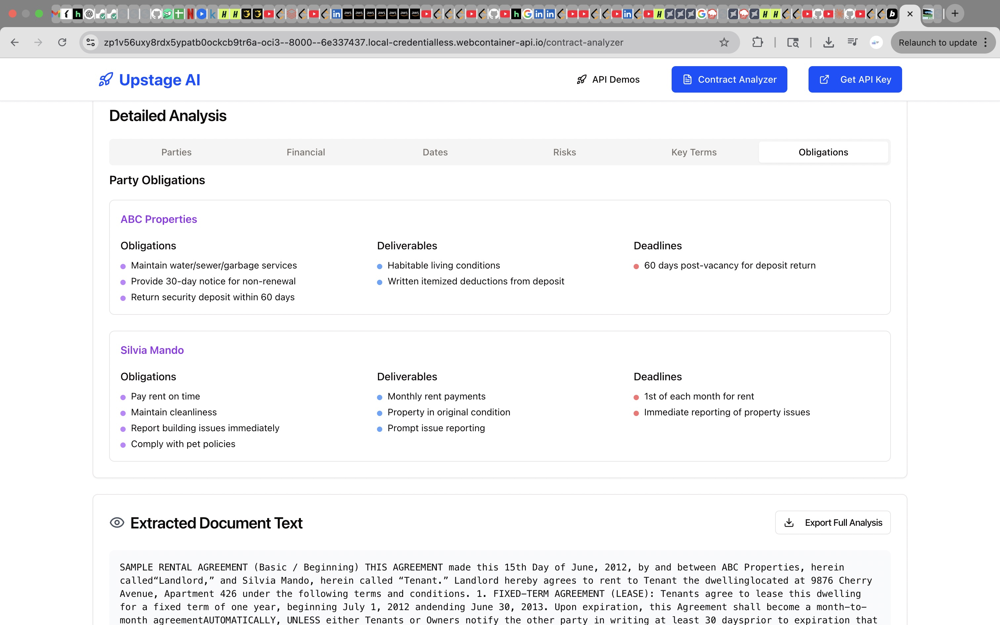
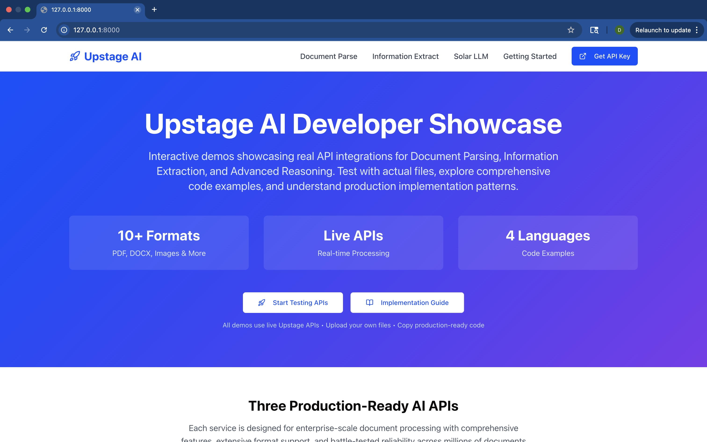

# 🚀 Upstage AI Demo Showcase: Smart Contract Analysis Platform

[](https://upstage-ai.onrender.com/)
[](https://github.com/DevangJagdale/Upstage-AI)
[]()

## !!! I am running my website on free services offered by Render, but when there’s no traffic, the server goes to sleep. Each time I use it, the service starts again, which can take up to a minute to get back online. Please be patient!!!

## For testing demo I have uploaded sample contract please feel free to use that

> A comprehensive, beginner-friendly demonstration of Upstage AI's enterprise-grade capabilities, showcasing a **Smart Contract Analysis Platform** that transforms legal contract review with AI-powered automation. Built with clear explanations, interactive examples, and step-by-step guidance to help developers of all skill levels understand and implement powerful AI document processing solutions.

## 📋 Table of Contents

- [🎯 Project Overview](#-project-overview)
- [🏢 Business Use Case: Smart Contract Analysis](#-business-use-case-smart-contract-analysis)
- [🛠️ Tech Stack](#️-tech-stack)
- [🌟 Why This Demo is Perfect for Beginners](#-why-this-demo-is-perfect-for-beginners)
- [✨ Interactive Demo Walkthrough](#-interactive-demo-walkthrough)
- [🖼️ Demo Screenshots & Explanations](#️-demo-screenshots--explanations)
- [🚀 Getting Started (Zero to Hero)](#-getting-started-zero-to-hero)
- [📚 Learning Resources & Tutorials](#-learning-resources--tutorials)
- [💡 Developer Experience Insights](#-developer-experience-insights)
- [🔮 Future Enhancements](#-future-enhancements)

## 🎯 Project Overview

This demo application showcases **Upstage AI's powerful document processing capabilities** through a **Smart Contract Analysis Platform**, designed to make AI accessible to developers at every skill level. Whether you're a complete beginner or an experienced developer, this platform demonstrates how to leverage Upstage's APIs to automate legal contract analysis, saving time, reducing costs, and ensuring consistent evaluations. With interactive examples, clear explanations, and a responsive UI, this demo provides real-world value without overwhelming technical complexity.



## 🏢 Business Use Case: Smart Contract Analysis

### Problem Solved
Manual contract review is time-consuming, expensive, and prone to errors:
- Takes hours or days to process complex legal documents.
- Requires costly legal expertise for risk assessment.
- Key terms and obligations are often missed.
- Inconsistent evaluations across different reviewers.

### AI-Powered Solution
The Smart Contract Analysis Platform combines **Upstage's Document Parse API** and **Solar LLM** to deliver enterprise-grade contract analysis:
1. **Document Parse Integration**:
   - Automatically extracts text from uploaded contracts (PDF, DOCX, DOC, TXT).
   - Preserves document structure and formatting.
   - Handles complex legal document layouts with high accuracy.
2. **Solar LLM Analysis**:
   - Performs comprehensive legal analysis with advanced reasoning.
   - Extracts key contract terms (parties, dates, financial terms, obligations).
   - Conducts risk assessment with specific risk factors and recommendations.
   - Generates a concise executive summary for quick decision-making.

### Key Features
- **📊 Risk Assessment Dashboard**:
  - Risk Level Classification: Low/Medium/High/Critical with visual indicators.
  - Risk Factors: Identifies specific issues with severity levels.
  - Recommendations: Provides actionable advice for risk mitigation.
  - Red Flags: Highlights critical issues requiring immediate attention.
- **📋 Key Terms Extraction**:
  - Parties: Identifies contracting entities and their roles (e.g., Landlord/Tenant, Buyer/Seller).
  - Financial Terms: Extracts total value, payment schedules, penalties, and deposits.
  - Important Dates: Captures effective dates, expiration, renewal, and milestones.
  - Termination Clauses: Details exit conditions and procedures.
- **👥 Obligation Mapping**:
  - Clear breakdown of each party's responsibilities and deliverables.
  - Organized by party with deadlines for easy review.
- **📄 Enhanced Analysis Features**:
  - **Contract Type Identification**: Automatically categorizes contracts (e.g., Real Estate, Employment, Lease) with subcategories and descriptions.
  - **Complete Party Information**: Extracts names, roles, and contact details.
  - **Comprehensive Financial Analysis**: Details total value, currency, payment schedules, penalties, and deposits.
  - **Important Dates & Milestones**: Visualizes effective dates, expiration, renewals, and key deadlines.
  - **Advanced Risk Assessment**: Provides a numerical risk score (1-100) and categorized risk factors.
  - **Key Legal Terms Analysis**: Covers termination clauses, liability limits, intellectual property, confidentiality, dispute resolution, and governing law.
  - **Interactive Tabbed Interface**: Organizes analysis into digestible tabs for easy navigation.
 







### Business Value
- **90% Faster Contract Review**: Reduces review time from hours to minutes.
- **24/7 Automated Analysis**: Available anytime without human intervention.
- **100% Consistent Evaluation**: Ensures uniform criteria across all reviews.
- **Significant Cost Reduction**: Minimizes reliance on expensive legal expertise.
- **50+ Risk Factors Analyzed**: Comprehensive risk assessment for informed decisions.

### Real-World Applications
- **Legal Firms**: Streamline contract review for clients.
- **Procurement Teams**: Quickly assess vendor agreements.
- **Real Estate**: Analyze lease agreements and purchase contracts.
- **HR Departments**: Review employment contracts and NDAs.
- **Business Development**: Evaluate partnership agreements.

### Technical Implementation
- **Frontend**: React with TypeScript, Tailwind CSS for responsive design.
- **Backend**: Express.js with Upstage API integration (Document Parse, Solar LLM).
- **File Processing**: Supports PDF, DOCX, DOC, TXT formats with a 50MB limit.
- **AI Pipeline**: Document Parse extracts text, Solar LLM provides structured analysis.
- **Debugging Support**:
  - Logs file information (name, size, type).
  - Tracks API response status and structure.
  - Reports text extraction details (length, first 500 characters).
  - Provides comprehensive error details if no text is found.

### Debugging Tips
If you encounter issues during document upload, check the browser console (F12 → Console tab) for:
- **Document Parse API Response**: Verify the response contains the expected `elements` array and text content.
- **Response Structure**: Ensure `elements` or `content.text` exists and contains valid data.
- **Error Details**: Look for logs indicating why text extraction failed (e.g., unsupported format, empty document).
- **Text Extraction Logic**: Confirm the extraction logic is accessing the correct fields (`elements`, `content.text`, `content.html`).

This helps identify whether the issue is with the API response, document parsing, or text extraction logic.

## 🛠️ Tech Stack

### 🎨 Frontend Architecture
- **⚛️ React 18.3.1**: Modern React with hooks for dynamic UI.
- **📘 TypeScript 5.5.3**: Type-safe development with IDE support.
- **⚡ Vite 5.4.2**: Fast build tool and development server.
- **🎨 Tailwind CSS 3.4.1**: Utility-first CSS for rapid, responsive UI design.
- **🧩 shadcn/ui**: Reusable UI components for a polished interface.

### 🔧 Build & Development
- **🎨 PostCSS 8.4.35**: CSS transformation and optimization.
- **🔄 Autoprefixer 10.4.18**: Automatic vendor prefix handling.
- **📱 Responsive Utilities**: Mobile-first design system for all devices.

### 🌐 Backend & API Integration
- **🖥️ Express.js**: Robust backend for handling API requests and file uploads.
- **🤖 Upstage Document Parse API**: Advanced OCR and layout analysis for text extraction.
- **🧠 Upstage Solar LLM**: Conversational AI for detailed contract analysis.
- **📤 Multer**: Handles file uploads for document processing.
- **🔐 Secure API Management**: Environment-based API key handling.

### 🚀 Deployment & Infrastructure
- **🌐 Render.com**: Cloud platform with automatic deployments and global CDN.
- **🔄 CI/CD Pipeline**: Automatic builds from GitHub repository.
- **📊 Performance Monitoring**: Built-in analytics and error tracking.

### 🔒 Security & Best Practices
- **🔐 Environment Variables**: Secure API key management (e.g., `UPSTAGE_API_KEY`).
- **🛡️ CORS Configuration**: Proper cross-origin resource sharing for local and production environments.
- **🔒 HTTPS Enforcement**: SSL/TLS encryption for all communications.
- **⏱️ Rate Limiting**: Client-side request throttling to prevent abuse.

### 🧪 Development Workflow
#### Local Development
```bash
# Development server with hot reload
npm run dev          # Start development server
npm run build        # Production build
npm run preview      # Preview production build
npm run lint         # Code linting
npm run type-check   # TypeScript validation
```

#### Code Organization
```
client/
├── src/
│   ├── components/
│   │   ├── ContractAnalyzer.tsx  # Smart Contract Analysis UI
│   │   ├── FileUpload.tsx        # File upload component
│   │   └── ui/                  # shadcn/ui components
server/
├── server.ts      # Standalone server for document parsing
├── routes.ts      # API routes for Upstage integration
├── index.ts       # Vite-integrated server for production
```

#### Bundle Analysis
```
Production Build Analysis
├── 📦 Main Bundle: ~150KB (gzipped)
├── 🎨 CSS Bundle: ~25KB (gzipped)
└── 🖼️ Assets: Optimized images and fonts
```

### Why This Tech Stack?
- **🚀 Developer Experience**: Vite’s fast hot reload, TypeScript’s type safety, and Tailwind’s rapid styling.
- **🎨 User Experience**: Responsive, accessible UI with smooth animations and immediate feedback.
- **🔧 Maintainability**: Clean architecture, type safety, and automated quality checks (ESLint, TypeScript).
- **📈 Scalability**: Component-based frontend, API-first backend, and optimized production builds.

## 🌟 Why This Demo is Perfect for Beginners

### 🎯 Zero Learning Curve
- **No AI Knowledge Required**: No need to understand machine learning or neural networks.
- **Instant Results**: Upload a contract and see AI-powered analysis in seconds.
- **Visual Feedback**: Clear progress indicators and interactive results.
- **Error-Friendly**: Helpful error messages guide users through issues (check browser console for details).

### 🔧 Simple Setup Process
```bash
# Three commands to start!
git clone https://github.com/DevangJagdale/Upstage-AI.git
cd Upstage-AI
npm install && npm run dev
```

### 📖 Built-in Learning Materials
- **Tooltips & Hints**: Hover over UI elements for explanations.
- **Example Documents**: Pre-loaded contracts for immediate testing.
- **Step-by-Step Guides**: Each feature includes a "How it Works" section.
- **Common Use Cases**: Real-world scenarios (e.g., lease analysis, vendor agreements).

### 🎮 Interactive Learning Experience
- **Try Before You Code**: Explore features without writing code.
- **Experiment Safely**: Sandbox environment with sample documents.
- **Compare Results**: See raw text vs. structured analysis side by side.
- **Progressive Disclosure**: Advanced features revealed as you learn.

## ✨ Interactive Demo Walkthrough

### 🚀 Getting Started Journey

#### Step 1: Welcome & Overview (30 seconds)
- **What You See**: A friendly welcome with a clean UI explaining the Smart Contract Analysis Platform.
- **Features**: Upload area, sample contracts, and three cards highlighting Document Parse, Risk Assessment, and Key Terms Extraction.
- **Action**: Click "Try Demo Documents" to test with pre-loaded contracts or upload your own.



#### Step 2: Document Parse Demo (2-3 minutes)
**What You Experience:**
1. **Upload Made Easy**: Drag-and-drop or click to upload contracts (PDF, DOCX, DOC, TXT).
2. **Real-Time Processing**: Watch the AI extract text with a progress indicator.
3. **Visual Results**: See extracted text (e.g., 8194 characters from a rental agreement) with structure preserved.
4. **Interactive Exploration**: View parties, dates, and financial terms in an organized interface.

**Beginner-Friendly Features:**
- **Sample Documents**: Try with provided contracts (e.g., lease agreements).
- **Progress Indicators**: Clear loading states (e.g., "Parsing Document...").
- **Error Handling**: Console logs detail file info, API response status, and text extraction results.
- **Format Support**: Handles multiple file formats up to 50MB.

**What You Learn:**
- How AI extracts text from complex legal documents.
- The difference between raw OCR and intelligent parsing.
- Real-world applications (e.g., automating contract review for legal firms).


#### Step 3: Solar LLM Analysis Demo (3-4 minutes)
**What You Experience:**
1. **Comprehensive Analysis**: AI analyzes the contract for type, parties, financial terms, dates, risks, and obligations.
2. **Structured Output**: Results displayed in a tabbed interface (Parties, Financial, Dates, Risks, Terms, Obligations).
3. **Risk Dashboard**: Visual indicators for risk levels, scores, and recommendations.
4. **Executive Summary**: Concise overview for quick decision-making.

**Beginner-Friendly Features:**
- **Tabbed Interface**: Easy navigation between analysis sections.
- **Visual Cues**: Icons for contract types (e.g., Home for Lease) and risk levels (e.g., CheckCircle for Low).
- **Export Options**: Download analysis as JSON or view full text.
- **Debugging Logs**: Console shows API response, parsed analysis, and text length.

**What You Learn:**
- How Solar LLM provides structured, actionable insights.
- Applications for risk assessment and term extraction.
- How to interpret AI-generated contract analysis.


## 🖼️ Demo Screenshots & Explanations

### 📄 Contract Analysis Interface
**What Beginners See:**
- **Clean Upload Area**: Large drag-and-drop zone for contracts.
- **Sample Contracts**: One-click lease agreements or NDAs to try immediately.
- **Processing Animation**: Visual feedback during parsing and analysis.
- **Tabbed Results**: Organized sections for Parties, Financial Terms, Risks, etc.

**Learning Outcomes:**
- Understand how AI processes legal documents.
- See the value of structured analysis over manual review.
- Learn to interpret risk scores and recommendations.

### 🔍 Risk Assessment Dashboard
**What Beginners See:**
- **Risk Level**: Color-coded badges (e.g., Green for Low, Red for High).
- **Risk Score**: Numerical score (1-100) with visual indicators.
- **Risk Factors**: Categorized issues (e.g., Legal, Financial) with severity.
- **Recommendations**: Actionable advice to mitigate risks.

**Learning Outcomes:**
- Grasp the concept of automated risk assessment.
- Understand how to prioritize contract issues.
- Learn to act on AI-generated recommendations.

### 🧠 Key Terms & Obligations
**What Beginners See:**
- **Tabbed Interface**: Separate tabs for Parties, Financial Terms, Dates, etc.
- **Visual Icons**: Home for leases, Briefcase for employment contracts.
- **Structured Data**: Clear lists of obligations, deliverables, and deadlines.
- **Text Preview**: First 2000 characters of extracted text with truncation.

**Learning Outcomes:**
- Experience AI-driven term extraction.
- Understand how to map party responsibilities.
- Learn about contract structure and key clauses.

### 🎯 Beginner-Friendly Code Examples
#### Simple Contract Upload
```typescript
const uploadContract = async (file: File) => {
  const formData = new FormData();
  formData.append('document', file);
  
  const response = await fetch(`${API_BASE_URL}/api/document-parse`, {
    method: 'POST',
    body: formData
  });
  
  const result = await response.json();
  console.log('Extracted text length:', result.elements?.join('\n').length);
  return result; // Parsed contract text
};
```

#### Analyze Contract with Solar LLM
```typescript
const analyzeContract = async (documentText: string) => {
  const response = await fetch(`${API_BASE_URL}/api/solar-chat`, {
    method: 'POST',
    headers: { 'Content-Type': 'application/json' },
    body: JSON.stringify({
      messages: [
        { role: 'user', content: `Analyze this contract: ${documentText}` }
      ],
      reasoningEffort: 'high'
    })
  });
  
  const analysis = await response.json();
  return analysis.choices[0].message.content; // Structured contract analysis
};
```

## 🚀 Getting Started (Zero to Hero)

### 🎯 For Complete Beginners
#### Never Used AI APIs Before?
No problem! This demo is your entry point to AI development.

**What You Need:**
- ✅ A computer with internet access.
- ✅ 15 minutes of free time.
- ✅ Curiosity about AI and contract analysis.
- ❌ No programming or AI knowledge required.

#### Your Learning Path:
**Phase 1: Explore (10 minutes)**
1. Visit the [live demo](https://upstage-ai.onrender.com/).
2. Try uploading a sample contract or use provided examples.
3. Explore the Risk Assessment Dashboard and tabbed analysis.
4. Check the browser console for debugging logs.

**Phase 2: Understand (15 minutes)**
1. Read the feature explanations in the UI.
2. Test different contracts (e.g., lease, NDA).
3. Review the structured analysis (parties, risks, terms).
4. Note how AI improves consistency and speed.

**Phase 3: Implement (30 minutes)**
1. Set up the demo locally (see below).
2. Explore the code in `ContractAnalyzer.tsx`.
3. Modify the analysis prompt or UI to experiment.
4. Use console logs to debug API responses.

### 🔧 Development Environment Setup
#### Prerequisites
- **Node.js**: JavaScript runtime ([nodejs.org](https://nodejs.org), LTS version).
- **Code Editor**: VS Code recommended (free).
- **Git**: Optional for version control.

#### Step-by-Step Setup
1. **Install Node.js** (5 minutes):
   - Download LTS version from [nodejs.org](https://nodejs.org).
   - Run installer with default settings.
2. **Get the Code** (2 minutes):
   ```bash
   git clone https://github.com/DevangJagdale/Upstage-AI.git
   # Or download ZIP from GitHub
   ```
3. **Install Dependencies** (3 minutes):
   ```bash
   cd Upstage-AI
   npm install
   ```
4. **Set Up API Key** (2 minutes):
   ```bash
   cp .env.example .env
   # Edit .env and add: UPSTAGE_API_KEY=your_api_key_here
   # Get key from https://console.upstage.ai
   ```
5. **Start the Demo** (1 minute):
   ```bash
   npm run build
   npm run dev
   # Open http://localhost:8000 in your browser
   ```

## 📚 Learning Resources & Tutorials

### 🎥 Video Walkthroughs
- **Demo Overview** (5 min): Tour of the Smart Contract Analysis Platform.
- **Setup Tutorial** (10 min): Local installation guide.
- **API Integration** (15 min): Using Upstage APIs in your projects.
- **Contract Analysis Use Cases** (20 min): Real-world examples (leases, NDAs).

### 📖 Written Guides
- **Beginner's Guide to Document AI**: Basics of document parsing and analysis.
- **Contract Analysis Best Practices**: Tips for accurate AI results.
- **Error Handling Guide**: Debugging API and parsing issues.
- **Performance Optimization**: Optimizing API calls and UI rendering.

### 🛠️ Interactive Tutorials
- **Build a Contract Analyzer**: 30-minute guided tutorial.
- **Custom Analysis Prompts**: Craft prompts for specific contract types.
- **Risk Assessment Setup**: Create custom risk evaluation logic.
- **Production Deployment**: Deploy to Render or other platforms.

### 🤝 Community Resources
- **Discord Community**: Join for developer support.
- **GitHub Discussions**: Share ideas and ask questions.
- **Stack Overflow**: Use `upstage-ai` tag for queries.
- **Developer Blog**: Tutorials and case studies.

## 💡 Developer Experience Insights

### 🎯 What Makes This Demo Special for Beginners
1. **Progressive Disclosure**:
   - Starts with simple uploads, progresses to detailed analysis.
   - Advanced features (e.g., custom prompts) introduced gradually.
2. **Immediate Feedback**:
   - Visual progress indicators (e.g., parsing, analyzing).
   - Clear console logs for debugging (file info, API status, text length).
   - Helpful error messages (e.g., "No text content found").
3. **Real-World Context**:
   - Uses actual contracts for relatable examples.
   - Quantifies benefits (90% faster review, 100% consistency).
   - Shows ROI for businesses (cost reduction, risk mitigation).
4. **Safety and Experimentation**:
   - Sandbox environment with sample contracts.
   - Reset options to start fresh.
   - No risk of breaking the demo.

### 🚀 Suggestions for Upstage Developer Engagement
#### Beginner-Focused Improvements
1. **Interactive Onboarding**:
   - Guided tour of the Contract Analyzer.
   - In-browser tutorials for API usage.
   - Achievement badges for completing tasks.
2. **Learning Resources**:
   - Video tutorials for contract analysis workflows.
   - Templates for common contract types (e.g., lease, NDA).
   - Troubleshooting guide for parsing errors.
3. **Community Building**:
   - Beginner Discord channels for Q&A.
   - Monthly webinars on AI for contract review.
   - Showcase gallery for user-built analyzers.
4. **Developer Tools**:
   - Visual prompt builder for Solar LLM.
   - Postman collections for Upstage APIs.
   - SDK with beginner-friendly examples.

#### Advanced Developer Engagement
1. **Technical Deep Dives**:
   - Performance benchmarks for Document Parse and Solar LLM.
   - Guides for fine-tuning analysis prompts.
   - Batch processing for large contract sets.
2. **Enterprise Features**:
   - Webhook support for real-time analysis.
   - Rate limiting and scaling strategies.
   - Security best practices for API integration.
3. **Innovation Programs**:
   - Hackathon kits for contract analysis apps.
   - Beta access to new Upstage features.
   - Developer advisory board for feedback.

## 🔮 Future Enhancements

### 🎓 Educational Features
- [ ] **Interactive Code Playground**: Edit and run contract analysis code in-browser.
- [ ] **Tutorial Mode**: Guided walkthroughs for each feature.
- [ ] **Progress Tracking**: Save learning milestones and achievements.
- [ ] **Certification Program**: Upstage AI Contract Analysis certification.

### 🛠️ Developer Tools
- [ ] **Visual Prompt Builder**: Drag-and-drop interface for Solar LLM prompts.
- [ ] **Analysis Dashboard**: Real-time metrics for API performance and accuracy.
- [ ] **Testing Suite**: Automated tests for contract parsing and analysis.
- [ ] **Schema Generator**: Tool for creating custom contract schemas.

### 🌐 Platform Integrations
- [ ] **No-Code Platforms**: Zapier, Power Automate for contract workflows.
- [ ] **CMS Plugins**: WordPress, Drupal integration for document uploads.
- [ ] **Cloud Storage**: Google Drive, Dropbox for direct contract access.
- [ ] **Business Tools**: Slack/Teams bots for contract notifications.

### 📱 Mobile & Accessibility
- [ ] **Mobile App**: iOS/Android apps for contract analysis on-the-go.
- [ ] **Voice Interface**: Voice commands for uploading and querying contracts.
- [ ] **Accessibility Features**: Screen reader support, keyboard navigation.
- [ ] **Offline Mode**: Basic analysis without internet (cached models).

---

<div align="center">
  <p><strong>Built with ❤️ to make AI-powered contract analysis accessible to every developer</strong></p>
  <p><em>"The best way to learn AI is to start analyzing real contracts with it"</em></p>
</div>
