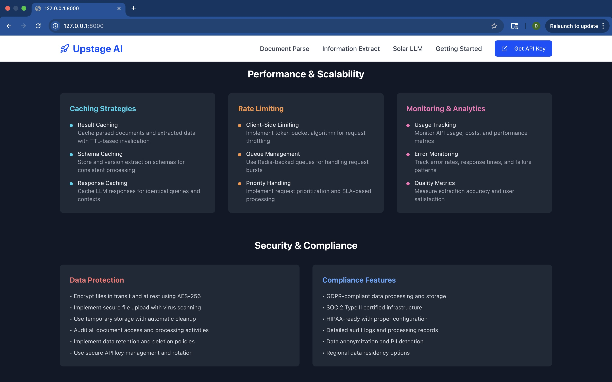

# Upstage AI Demo Showcase

A comprehensive, production-ready developer showcase demonstrating Upstage's three core AI capabilities through live demos, real API integrations, and extensive documentation. This application serves as both a functional demo platform and an educational resource for developers looking to integrate Upstage's AI services.

## 🎯 What This Demo Demonstrates


### Document Parse API - Advanced Document Digitization
**Live Demo Features:**
- **Real-time document processing** using Upstage's Document Parse API
- **Multiple input formats:** PDF, DOCX, PPTX, XLSX, PNG, JPG, JPEG, HEIC, HWP, HWPX
- **Output format selection:** HTML, Markdown, JSON with live preview
- **Advanced layout detection:** Tables, figures, charts, equations, headers, footers
- **Chart recognition:** Automatic conversion of bar charts, line charts, and pie charts to structured data
- **Equation parsing:** LaTeX format output for mathematical equations
- **Coordinate mapping:** Precise element positioning for advanced use cases


**What You Can Test:**
- Upload invoices, contracts, research papers, financial reports
- See how complex layouts are preserved and structured
- Test chart recognition with business reports
- Experiment with different output formats
- View processing metadata and confidence scores

### Information Extract API - Schema-Based Data Extraction
**Live Demo Features:**
- **Custom schema builder** with JSON Schema validation
- **Automatic schema generation** from sample documents (1-3 files)
- **Pre-built schemas** for common document types (invoices, resumes, bank statements, receipts)
- **Real-time extraction** with structured JSON output
- **Schema validation** and error handling
- **Multi-document processing** for schema generation


**What You Can Test:**
- Create custom extraction schemas for your specific use case
- Use auto-generation to quickly build schemas from examples
- Test with various document types and formats
- See how AI understands implicit information (totals, relationships)
- Experiment with complex nested data structures

### Solar LLM API - Advanced Reasoning & Analysis
**Live Demo Features:**
- **Interactive chat interface** with document context
- **Reasoning effort levels:** Low, Medium, High with visible thinking process
- **Chain of thought display** showing AI reasoning steps
- **Document-grounded responses** with accurate citations
- **Multi-turn conversations** maintaining context
- **Use case examples:** Contract analysis, financial reports, research papers, resume screening


**What You Can Test:**
- Ask complex questions about uploaded documents
- See the AI's reasoning process in real-time
- Test different reasoning effort levels
- Explore various analysis types (summarization, comparison, risk assessment)
- Try multi-step analytical tasks

## 📊 Demo Scenarios & Sample Data

### Document Parse Scenarios
1. **Financial Invoice Processing**
   - Sample: Multi-page invoices with tables, line items, tax calculations
   - Demonstrates: Table extraction, total calculation, metadata parsing
   - Expected Output: Structured HTML/Markdown with preserved formatting

2. **Academic Paper Analysis**
   - Sample: Research papers with equations, charts, complex layouts
   - Demonstrates: Equation recognition, figure extraction, section parsing
   - Expected Output: LaTeX equations, structured content hierarchy

3. **Business Report Processing**
   - Sample: Corporate reports with charts, financial data, complex tables
   - Demonstrates: Chart-to-data conversion, table structure preservation
   - Expected Output: Structured data with chart tables, preserved layout

### Information Extract Scenarios
1. **Invoice Data Extraction**
   - Input: Various invoice formats (PDF, scanned images)
   - Schema: Invoice number, date, vendor, line items, totals, tax information
   - Expected Output: Structured JSON with all invoice details

2. **Resume Processing**
   - Input: Resume documents in various formats
   - Schema: Personal info, experience, education, skills, certifications
   - Expected Output: Standardized candidate profiles

3. **Contract Analysis**
   - Input: Legal contracts, agreements, terms of service
   - Schema: Parties, terms, dates, obligations, penalties, renewal clauses
   - Expected Output: Key contract terms in structured format

4. **Bank Statement Processing**
   - Input: Bank statements (PDF, images)
   - Schema: Account info, transactions, balances, fees
   - Expected Output: Structured financial data

### Solar LLM Analysis Scenarios
1. **Contract Risk Assessment**
   - Document: Complex service agreements, vendor contracts
   - Queries: "What are the key risks?", "Identify termination clauses", "Compare with industry standards"
   - Demonstrates: Multi-step reasoning, risk analysis, contextual understanding

2. **Financial Report Analysis**
   - Document: Quarterly reports, earnings statements
   - Queries: "Summarize key performance indicators", "Identify trends", "Compare year-over-year"
   - Demonstrates: Data analysis, trend identification, comparative reasoning

3. **Research Paper Insights**
   - Document: Academic papers, technical reports
   - Queries: "Summarize methodology", "Identify limitations", "Compare with related work"
   - Demonstrates: Technical comprehension, critical analysis, synthesis

## 🛠 Technical Implementation

### Architecture Overview
```
├── Frontend (React + TypeScript + Vite)
│   ├── Interactive demo components
│   ├── Real-time API integration
│   ├── Code example generators
│   └── Responsive UI with Tailwind CSS
│
├── Backend (Node.js + Express)
│   ├── Upstage API integration
│   ├── File upload handling
│   ├── Error handling & validation
│   └── CORS and security middleware
│
└── Shared Types & Schemas
    ├── TypeScript interfaces
    ├── API request/response types
    └── Schema validation
```

## 🚀 Quick Start Guide

### Prerequisites
- Node.js 18 or higher
- Upstage API key from [console.upstage.ai](https://console.upstage.ai)

### Installation & Setup

1. **Clone and Install**
```bash
git clone <repository-url>
cd upstage-demo-showcase
npm install
```

2. **Environment Configuration**
Create `.env` file:
```bash
UPSTAGE_API_KEY=your_api_key_here
```

3. **Development Server**
```bash
npm run dev
```

4. **Access Demo**
Open `http://127.0.0.1:8000` to explore the interactive demos

### Production Deployment

**Vercel Deployment (Zero Configuration):**
1. Connect your GitHub repository to Vercel
2. Add environment variables in Vercel dashboard
3. Deploy automatically on push

**Manual Deployment:**
```bash
npm run build
npm start
```

## 📖 Code Examples & Implementation Guides

### Python Integration Example
```python
import requests
import base64
import json

class UpstageClient:
    def __init__(self, api_key):
        self.api_key = api_key
        self.base_url = "https://api.upstage.ai/v1"
    
    def parse_document(self, file_path):
        with open(file_path, 'rb') as file:
            response = requests.post(
                f"{self.base_url}/document-digitization",
                headers={"Authorization": f"Bearer {self.api_key}"},
                files={"document": file},
                data={"model": "document-parse"}
            )
        return response.json()
    
    def extract_information(self, file_path, schema):
        # Implementation details in demo
        pass
    
    def chat_with_solar(self, messages):
        # Implementation details in demo
        pass
```

### JavaScript/Node.js Integration
```javascript
import { UpstageAPI } from './upstage-client.js';

const client = new UpstageAPI('your_api_key');

// Document parsing
const parseResult = await client.parseDocument({
    document: fileInput.files[0],
    outputFormat: 'html'
});

// Information extraction
const extractResult = await client.extractInformation({
    document: fileInput.files[0],
    schema: customSchema
});

// Solar LLM chat
const chatResult = await client.chatWithSolarLLM({
    messages: conversationHistory,
    reasoning_effort: 'high'
});
```

## 🔍 Testing & Validation

### Sample Test Documents
The demo includes curated test documents for each service:

1. **Document Parse Samples:**
   - Multi-page invoice with complex tables
   - Academic paper with equations and charts
   - Financial report with mixed content types

2. **Information Extract Samples:**
   - Standardized invoice formats
   - Various resume layouts
   - Contract templates
   - Bank statement formats

3. **Solar LLM Test Cases:**
   - Contract analysis scenarios
   - Financial data interpretation
   - Research paper summarization

### Performance Benchmarks
- Document Parse: Processes 10-page PDF in ~3-5 seconds
- Information Extract: Extracts data from complex forms in ~2-4 seconds  
- Solar LLM: Provides reasoned responses in ~5-10 seconds (high effort)

## 🎯 Use Cases Demonstrated

### Business Process Automation
- **Invoice Processing:** Automated data extraction for accounting systems
- **Contract Management:** Risk assessment and key term extraction
- **Document Digitization:** Legacy document conversion to searchable formats

### Research & Analysis
- **Academic Paper Processing:** Metadata extraction and content analysis
- **Financial Analysis:** Report summarization and trend identification
- **Legal Document Review:** Clause identification and risk assessment

### Data Pipeline Integration
- **ETL Processes:** Document-to-database workflows
- **Content Management:** Automated categorization and tagging
- **Quality Assurance:** Automated document validation and verification

## 📈 Advanced Features Explored

### Schema Generation Workflow
1. Upload 1-3 sample documents
2. AI analyzes structure and content patterns
3. Generates optimized JSON schema
4. Manual refinement and validation
5. Production-ready extraction schema

### Reasoning Chain Visualization
- Step-by-step problem decomposition
- Evidence gathering and validation
- Logical inference and conclusion
- Confidence scoring and uncertainty handling

### Error Handling & Recovery
- Invalid file format detection
- Schema validation and suggestions
- API rate limiting and retries
- Graceful degradation strategies

## 💡 Developer Tips & Best Practices

### Document Preparation
- Use high-resolution scans (minimum 150 DPI)
- Ensure minimum text size (2.5% of image height)
- Split large documents for better performance
- Consider document orientation and rotation

### Schema Design
- Use descriptive property names and descriptions
- Leverage arrays for repeating data structures
- Keep schemas under 10,000 characters total
- Limit to 50 properties per schema
- Test with diverse document samples

### Performance Optimization
- Implement proper caching strategies
- Use async/await for non-blocking operations
- Handle rate limits gracefully
- Implement retry logic with exponential backoff
- Monitor usage and costs

## 🔧 Troubleshooting Guide

### Common Issues and Solutions

**Document Parse Issues:**
- Large files: Split into smaller documents or use async API
- Poor quality scans: Increase resolution, improve lighting
- Complex layouts: Try different output formats

**Information Extract Issues:**
- Inconsistent results: Refine schema descriptions
- Missing data: Check schema property types and descriptions
- Schema errors: Validate JSON schema syntax

**Solar LLM Issues:**
- Slow responses: Reduce reasoning effort level
- Context limits: Summarize long documents first
- Unclear responses: Provide more specific questions

## 📚 Additional Resources

- [Upstage API Documentation](https://console.upstage.ai/docs)
- [Developer Playground](https://console.upstage.ai/playground)
- [Community Discord](https://discord.gg/upstage)
- [GitHub Examples](https://github.com/upstage-ai)
- [Support Center](https://console.upstage.ai/support)

## 🤝 Contributing

This demo showcase is designed to be extended and customized:

1. Fork the repository
2. Add new demo scenarios
3. Enhance UI components
4. Submit pull requests

## 📄 License

Feel free to use this demo as a starting point for your own projects.

---

**Built with ❤️ for the developer community** | **Powered by Upstage AI**

install
`npm install`, `npm install openai lucide-react`,`npm install form-data`,`npm install express cors multer node-fetch`,`npm install -g tsx` 