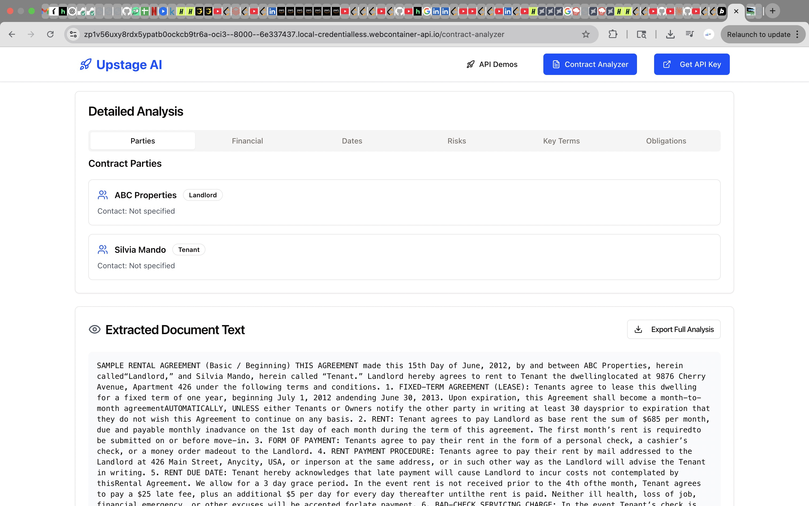
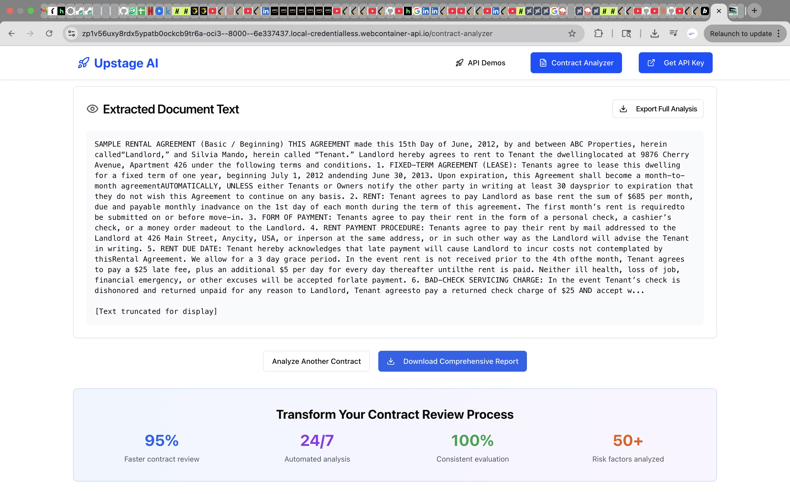
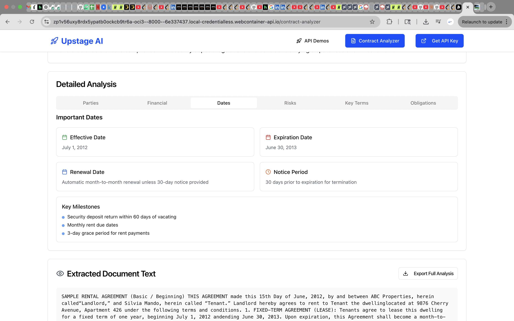
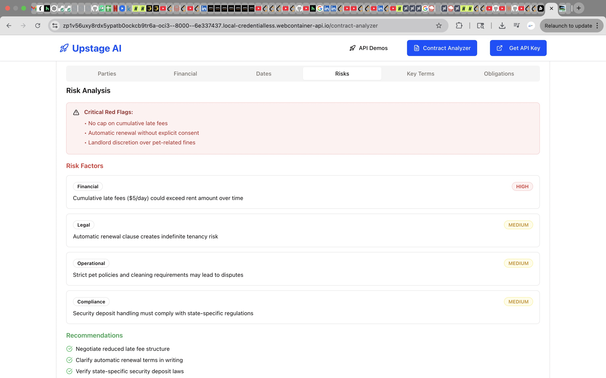
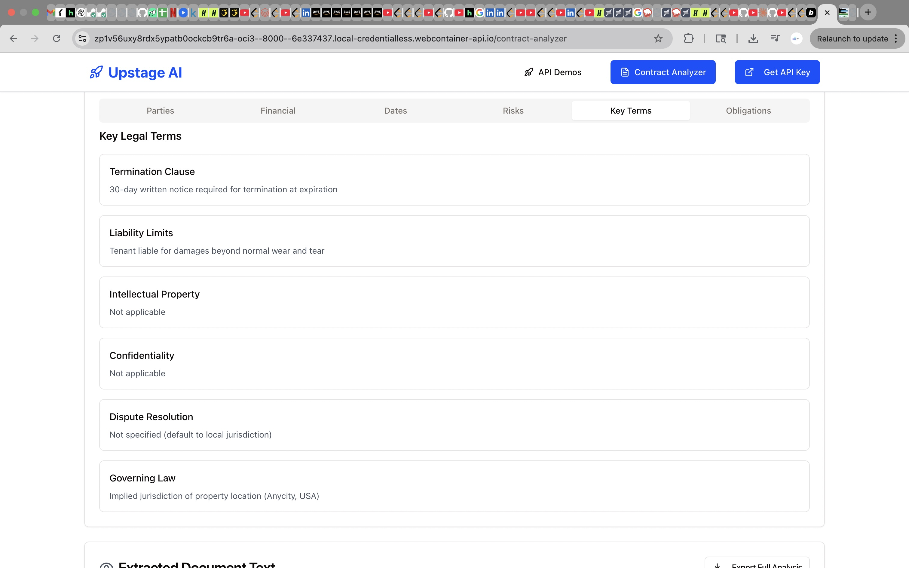
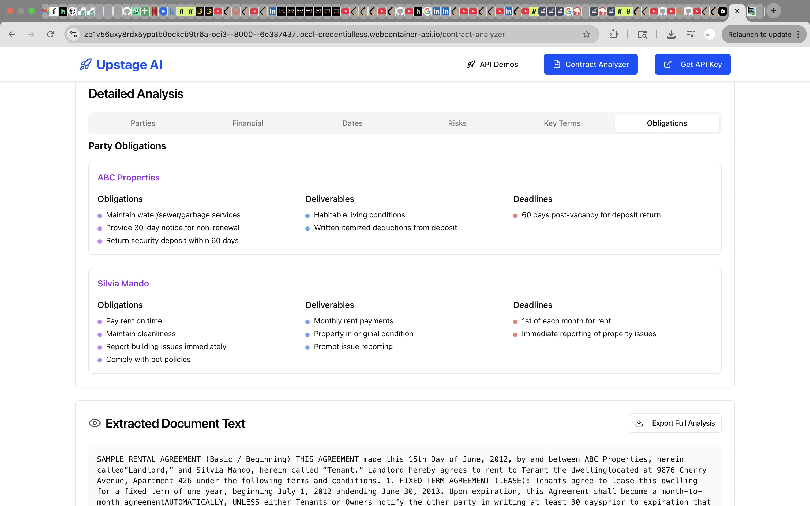

## !!! please visit https://github.com/DevangJagdale/Smart-contract-analyzer for latest code!!!

# 🚀 Smart Contract Analysis Platform

[]([https://upstage-ai.onrender.com/](https://smart-contract-analyzer.onrender.com))

## !!! I am running my website on free services offered by Render, but when there’s no traffic, the server goes to sleep. Each time I use it, the service starts again, which can take up to a minute to get back online. Please be patient!!!

## For testing demo I have uploaded sample contract please feel free to use that

> A comprehensive, beginner-friendly demonstration of Upstage AI's enterprise-grade capabilities, showcasing a **Smart Contract Analysis Platform** that transforms legal contract review with AI-powered automation. Built with clear explanations, interactive examples, and step-by-step guidance to help developers of all skill levels understand and implement powerful AI document processing solutions.

## What this project does

- Upload a contract and parse document text/structure
- Run AI analysis to extract:
  - Contract type
  - Parties
  - Financial terms
  - Important dates
  - Risk assessment
  - Key terms and obligations
- Show results in a clean, tabbed UI

### Problem Solved
Manual contract review is time-consuming, expensive, and prone to errors:
- Takes hours or days to process complex legal documents.
- Requires costly legal expertise for risk assessment.
- Key terms and obligations are often missed.
- Inconsistent evaluations across different reviewers.


### Key Features
- **📊 Risk Assessment Dashboard**:
  - Risk Level Classification: Low/Medium/High/Critical with visual indicators.
  - Risk Factors: Identifies specific issues with severity levels.
  - Recommendations: Provides actionable advice for risk mitigation.
  - Red Flags: Highlights critical issues requiring immediate attention.
- **📋 Key Terms Extraction**:
  - Parties: Identifies contracting entities and their roles (e.g., Landlord/Tenant, Buyer/Seller).
  - Financial Terms: Extracts total value, payment schedules, penalties, and deposits.
  - Important Dates: Captures effective dates, expiration, renewal, and milestones.
  - Termination Clauses: Details exit conditions and procedures.
- **👥 Obligation Mapping**:
  - Clear breakdown of each party's responsibilities and deliverables.
  - Organized by party with deadlines for easy review.
- **📄 Enhanced Analysis Features**:
  - **Contract Type Identification**: Automatically categorizes contracts (e.g., Real Estate, Employment, Lease) with subcategories and descriptions.
  - **Complete Party Information**: Extracts names, roles, and contact details.
  - **Comprehensive Financial Analysis**: Details total value, currency, payment schedules, penalties, and deposits.
  - **Important Dates & Milestones**: Visualizes effective dates, expiration, renewals, and key deadlines.
  - **Advanced Risk Assessment**: Provides a numerical risk score (1-100) and categorized risk factors.
  - **Key Legal Terms Analysis**: Covers termination clauses, liability limits, intellectual property, confidentiality, dispute resolution, and governing law.
  - **Interactive Tabbed Interface**: Organizes analysis into digestible tabs for easy navigation.
 







### Business Value
- **90% Faster Contract Review**: Reduces review time from hours to minutes.
- **24/7 Automated Analysis**: Available anytime without human intervention.
- **100% Consistent Evaluation**: Ensures uniform criteria across all reviews.
- **Significant Cost Reduction**: Minimizes reliance on expensive legal expertise.
- **50+ Risk Factors Analyzed**: Comprehensive risk assessment for informed decisions.

### Real-World Applications
- **Legal Firms**: Streamline contract review for clients.
- **Procurement Teams**: Quickly assess vendor agreements.
- **Real Estate**: Analyze lease agreements and purchase contracts.
- **HR Departments**: Review employment contracts and NDAs.
- **Business Development**: Evaluate partnership agreements.

### Technical Implementation
- **Frontend**: React with TypeScript, Tailwind CSS for responsive design.
- **Backend**: Express.js with Upstage API integration (Document Parse, Solar LLM).
- **File Processing**: Supports PDF, DOCX, DOC, TXT formats with a 50MB limit.
- **AI Pipeline**: Document Parse extracts text, Solar LLM provides structured analysis.
- **Debugging Support**:
  - Logs file information (name, size, type).
  - Tracks API response status and structure.
  - Reports text extraction details (length, first 500 characters).
  - Provides comprehensive error details if no text is found.


## Tech stack

- Frontend: React, TypeScript, Vite, Tailwind, shadcn/ui
- Backend: Express, Multer
- AI: Google Gemini API

## Requirements

- Node.js 18+
- npm
- A Gemini API key with active quota

## Environment setup

1. Copy env template:

```bash
cp .env.example .env
```

2. Edit `.env` and set your key:

```env
GEMINI_API_KEY=your_real_api_key
GEMINI_MODEL=gemini-2.5-flash
GEMINI_FALLBACK_MODELS=gemini-2.5-flash-lite,gemini-3.1-flash-lite,gemini-3-flash
```

## Run locally

```bash
npm install
npm run dev
```

App URL:

- `http://localhost:8000`

Default landing route:

- `/` redirects to `/contract-analyzer`

Other route:

- `/home` (optional demo page)

## Verify API/key quickly

```bash
curl -s http://localhost:8000/api/health
```

Expected fields:

- `status: "ok"`
- `geminiApiConfigured: true`
- `model` and `fallbackModels`

If `geminiApiConfigured` is `false`, check your `.env` and restart the dev server.

## Common issues

### 1) `Missing GEMINI_API_KEY`

- `.env` missing key, typo in variable name, or server not restarted.

### 2) Quota/rate-limit errors

- API key is valid but project has no usable quota for selected model.
- Use a key/project with billing/quota enabled.
- Keep fallback models configured in `.env`.

### 3) JSON parsing fallback in analysis

- Handled by server JSON mode + parsed response fallback.
- If a very large contract still fails, retry or reduce input size.

## Scripts

```bash
npm run dev      # start dev server
npm run build    # production build
npm run start    # run production bundle
npm run check    # TypeScript check
```

## Notes

- `.env` is ignored by git.
- Do not commit API keys.
